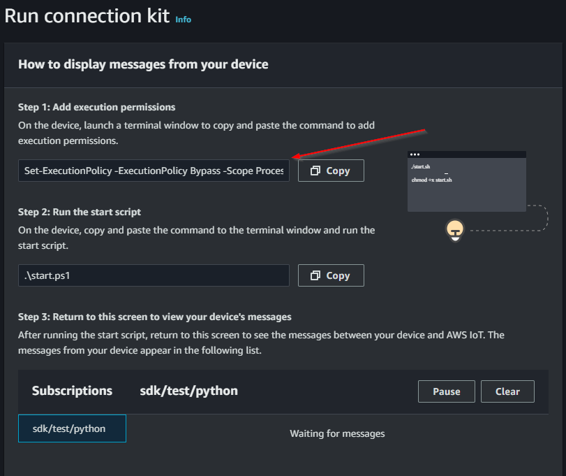
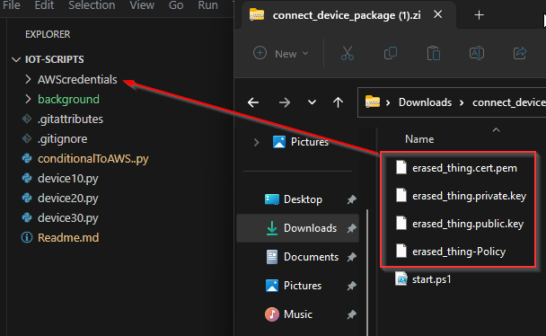

# Scripts para iot labs

### inicializar el servicio mosquito

```bash
net start mosquitto

net stop mosquitto
```

### emulador de dispositivos locales:

Dispositivos que emulan dispositivos o servidores intermediarios "...ping Device ## local... [###]"
-> device10.py, device20.py & device30.py

### para verificar el trafico:

```bash
Terminal command:

mosquitto_sub -h localhost -p 1883 -t "local/#"
```

***aws_conexion/publicateToAWS.py***

Nuevo archivo con la logica para tranferir el mensaje del broker mqtt mosquitto hacia aws iot core


### Condicional para diferentes topicos

***conditionalToAWS.py***

este script configura una suscripcion de escucha a los topicos locales y republica en aws iot core según corresponda al topico de origen local.


## Configuración

Para configurar correctamente el script ```conditionalToAWS..py``` se debera descargar los certificados otorgados por **AWS iot core**, obtener el endpoint y el clientId.

Obtener endpoint:
Dirigirse a la parte izquierda de la consola y acceder a "configuraciones", desde esta sección es visible el endpoint de *iot core*


paso 1:
Dirigirse a "Conectar un dispositivo" y seguir los pasos siguientes.


paso 2:
Escoger un objeto existente o crear uno nuevo.


paso 3:
Escoger la plataforma donde se trabajará, en este caso es **windows** para el Sistema Operativo y **python** como SDK.


paso 4:
Descargar el "kit" (Obligatorio) y descomprimir, ubicar y tratar las credenciales con precaución.


paso 5:
En Windows, desde inicio, *abrir Power Shell como administrador*, seguido copiar y ejecutar el comando que muestra el paso 5 de la consola de AWS.

Con esto se consigue eliminar las restricciones que puedan surgir con el sistema operativo y la ejecución del script personalizado.


Credenciales:
Descomprimir y se sugiere solo colocar los archivos listados:
- *.cert.pem
- *.private.key
- *.public.key
- *-Policy
(**start.ps1** es un archivo de prueba proporcionado por AWS)
